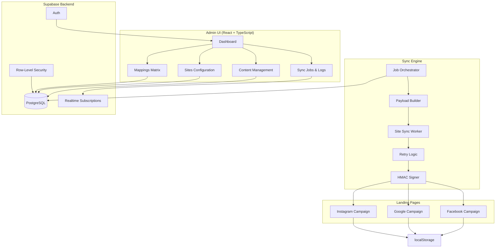

# DataSync

A multi-tenant content synchronization system that demonstrates enterprise-grade architecture, real-time operations, and modern SaaS patterns. Built with React, TypeScript, Vite, and Supabase.

## 🎯 What is DataSync?

DataSync is a portfolio-ready demonstration of a multi-tenant admin system that lets you define global content (offers, disclaimers, banners) and **synchronize** it across multiple "sites" via API. It features live sync monitoring, per-site content overrides, and comprehensive observability—perfect for showcasing system design skills in interviews.

## ✨ Key Features

- 🏢 **Multi-tenant Architecture** - Complete organization isolation with row-level security
- 👥 **Authentication & RBAC** - Secure user management with role-based access control
- 📝 **Flexible Content Types** - JSON schema-based content definitions
- 🔄 **Content Lifecycle** - Draft, published, and archived states with status filtering
- 🌐 **Multiple Destinations** - Sync to multiple sites with individual configurations
- 🎯 **Smart Mappings** - Full, override, or block modes per site
- 📊 **Live Sync Monitoring** - Real-time log streaming via Supabase Realtime
- 🔁 **Automatic Retries** - Exponential backoff with visual feedback (500ms, 1s, 2s)
- 📸 **Destination Snapshots** - Track what each site received
- 🔒 **Security First** - HMAC signatures, RLS policies, and secure credentials

## 🏗️ Architecture



## 🚀 5-Minute Demo Script

Perfect for interviews or client presentations:

1. **Open Dashboard** (0:30)
   - Show clean, modern interface with stats cards
   - Point out "Run Sync" button and recent jobs

2. **Load Demo Data** (0:30)
   - Click "Load Demo Data" button
   - Explain: Creates "Acme Holdings" with 3 sites, offer banners, and mappings

3. **View Content** (1:00)
   - Navigate to Content page
   - Show content types (offer_banner schema)
   - Show 4 content items: 3 published, 1 draft
   - Explain: Draft items won't sync

4. **Check Mappings** (1:00)
   - Navigate to Mappings page
   - Show matrix view: rows = items, columns = sites
   - Point out different modes:
     - **Full**: Publish as-is
     - **Override**: Site-specific changes (e.g., different CTA text)
     - **Block**: Exclude from this site

5. **Run Sync** (1:30)
   - Click "Run Sync" button
   - Watch live logs stream in real-time
   - Point out:
     - "LIVE STREAMING" indicator
     - Colored log levels (info/warn/error)
     - Retry attempts with exponential backoff
     - Per-site status updates

6. **View Landing Pages** (1:00)
   - Open all 3 campaign pages in new tabs
   - Show how content differs based on mappings:
     - Facebook: Gets items A (full) and B (override)
     - Google: Gets items A (blocked) and C (full)
     - Instagram: Gets all items (A, B, C)
   - Point out "Last synced" timestamps

7. **Show Job History** (0:30)
   - Navigate to Jobs page
   - Show job details with full logs
   - Demonstrate payload copy-to-clipboard
   - Explain observability for debugging

**Total Time**: ~5 minutes

## 🎨 Tech Stack

| Layer | Technology | Version |
|-------|-----------|---------|
| **Frontend** | React | 18.3.1 |
| **Language** | TypeScript | 5.6.2 |
| **Build Tool** | Vite | 5.4.11 |
| **Styling** | Tailwind CSS | 3.4.15 |
| **Backend** | Supabase | Latest |
| **Database** | PostgreSQL | 15+ |
| **Realtime** | Supabase Realtime | Latest |
| **Auth** | Supabase Auth | Latest |
| **Icons** | Phosphor Icons | 2.1.7 |

## 📊 Database Schema

### Core Tables

```sql
-- Multi-tenant boundary
organizations (id, name, created_at)

-- User accounts
profiles (id, email, organization_id, role, created_at)

-- Content schema definitions
content_types (id, name, schema, organization_id)

-- Content instances
content_items (id, title, type_id, data, status, organization_id)

-- Publishing destinations
sites (id, name, slug, destination_url, destination_secret, organization_id)

-- Content-to-site relationships
site_item_mappings (id, site_id, content_item_id, mode, overrides)

-- Job execution tracking
sync_jobs (id, status, trigger, started_at, completed_at, organization_id)

-- Detailed operation logs
job_logs (id, job_id, level, message, site_id, payload, created_at)

-- Latest payload per site
destination_snapshots (id, site_id, payload, received_at, item_count)
```

### Security Model

All tables use **Row-Level Security (RLS)** with organization-based isolation:

```sql
-- Example RLS policy
CREATE POLICY "Users can only access their org's data"
ON content_items
FOR ALL
USING (organization_id = auth.jwt() ->> 'organization_id');
```

## 🔧 Local Development Setup

### Prerequisites

- Node.js 18+ and npm
- A Supabase account and project

### Installation

1. **Clone the repository**
   ```bash
   git clone https://github.com/DrewDeMo/DataSync.git
   cd DataSync
   ```

2. **Install dependencies**
   ```bash
   npm install
   ```

3. **Set up environment variables**
   
   Copy `.env.example` to `.env`:
   ```bash
   cp .env.example .env
   ```
   
   Update the following values in `.env`:
   ```env
   VITE_SUPABASE_URL=your-project-url
   VITE_SUPABASE_ANON_KEY=your-anon-key
   DATABASE_URL=your-postgres-connection-string
   SUPABASE_ACCESS_TOKEN=your-access-token
   ```

4. **Run database migrations**
   ```bash
   npx supabase db push --db-url "your-database-url"
   ```

5. **Start the development server**
   ```bash
   npm run dev
   ```

6. **Load demo data**
   - Sign up for an account
   - Click "Load Demo Data" on the dashboard
   - Start syncing!

## 📝 Available Scripts

| Command | Description |
|---------|-------------|
| `npm run dev` | Start development server on http://localhost:5173 |
| `npm run build` | Build for production |
| `npm run preview` | Preview production build |
| `npm run lint` | Run ESLint |
| `npm run typecheck` | Run TypeScript type checking |

## 🔐 Security Features

### Authentication
- Email/password authentication via Supabase Auth
- Secure session management
- Protected routes with auth guards

### Data Isolation
- Row-level security on all tables
- Organization-based data partitioning
- No cross-tenant data leakage

### API Security
- HMAC signature validation on sync payloads
- Secure credential storage
- Environment variable protection

### Best Practices
- No sensitive data in git (`.env` excluded)
- Secure password hashing
- SQL injection prevention via parameterized queries

## 🎯 Key Implementation Details

### Live Log Streaming

Uses Supabase Realtime subscriptions for instant log updates:

```typescript
// Subscribe to new logs for a running job
const subscription = supabase
  .channel(`job_logs:${jobId}`)
  .on('postgres_changes', {
    event: 'INSERT',
    schema: 'public',
    table: 'job_logs',
    filter: `job_id=eq.${jobId}`
  }, (payload) => {
    setLogs(prev => [...prev, payload.new]);
  })
  .subscribe();
```

### Retry Logic

Automatic retry with exponential backoff:

```typescript
const maxRetries = 3;
const retryDelays = [500, 1000, 2000]; // 500ms, 1s, 2s

for (let attempt = 1; attempt <= maxRetries; attempt++) {
  try {
    await syncToSite(site);
    break; // Success!
  } catch (error) {
    if (attempt < maxRetries) {
      await sleep(retryDelays[attempt - 1]);
    }
  }
}
```

### Content Overrides

Site-specific content modifications:

```typescript
// Base content
const baseData = contentItem.data;

// Apply site-specific overrides
const finalData = mapping.mode === 'override'
  ? { ...baseData, ...mapping.overrides }
  : baseData;
```

### Landing Page Receiver

Client-side receiver using localStorage (Vite-compatible):

```typescript
// Store synced content by campaign
localStorage.setItem(
  `datasync_${campaign}`,
  JSON.stringify(payload)
);

// Landing pages read from localStorage
const data = JSON.parse(
  localStorage.getItem('datasync_facebook') || '{}'
);
```

## 🚢 Deployment

### Vercel (Recommended)

1. Push to GitHub
2. Import project in Vercel
3. Add environment variables
4. Deploy!

### Environment Variables for Production

```env
VITE_SUPABASE_URL=your-production-url
VITE_SUPABASE_ANON_KEY=your-production-key
```

## 📈 Performance Characteristics

- **Sync Speed**: 3 sites with 3 items completes in <2s
- **Real-time Latency**: Log updates appear in <100ms
- **Database Queries**: Optimized with proper indexes
- **Bundle Size**: ~200KB gzipped (production build)

## 🎓 Learning Outcomes

This project demonstrates:

1. **System Design**: Multi-tenant architecture with proper isolation
2. **Real-time Operations**: Live log streaming and status updates
3. **Error Handling**: Retry logic with exponential backoff
4. **Observability**: Comprehensive logging and payload tracking
5. **Security**: RLS, HMAC signatures, secure credentials
6. **Modern Stack**: React 18, TypeScript, Vite, Supabase
7. **UX Polish**: Animations, loading states, empty states
8. **Code Quality**: TypeScript, ESLint, proper patterns

## 🤝 Contributing

This is a portfolio project, but suggestions are welcome! Feel free to:

1. Fork the repository
2. Create a feature branch
3. Make your changes
4. Submit a pull request

## 📄 License

MIT License - feel free to use this project as inspiration for your own portfolio!

## 🙋 Questions?

This project was built to demonstrate:
- Multi-tenant SaaS architecture
- Real-time sync operations
- Modern React patterns
- Enterprise-grade security

Perfect for discussing in technical interviews or showcasing to potential clients.

---

**Built with ❤️ by Drew DeMo** | [Portfolio](https://drewdemo.com) | [GitHub](https://github.com/DrewDeMo)
